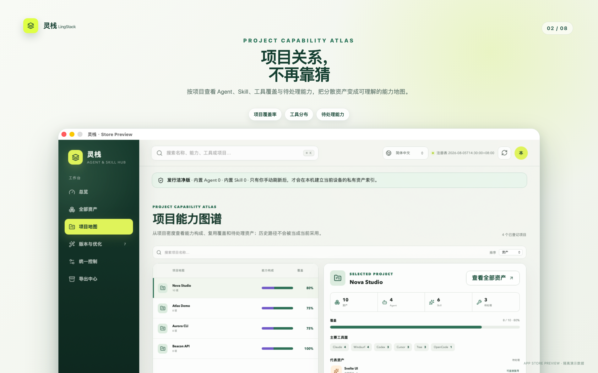
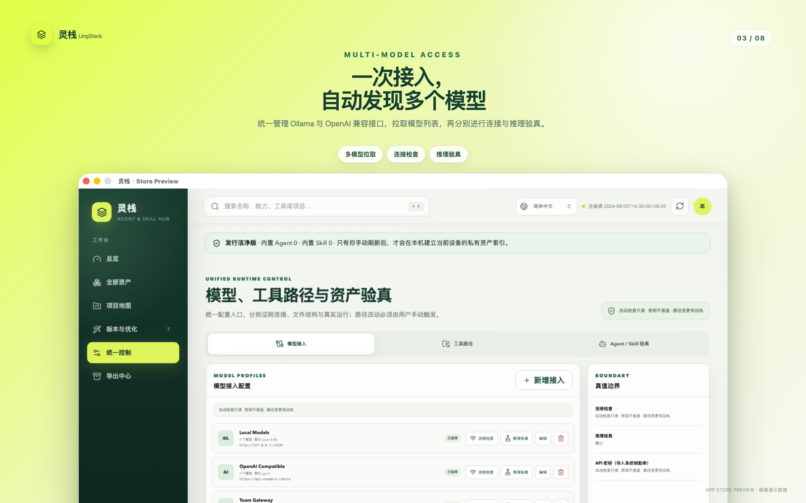
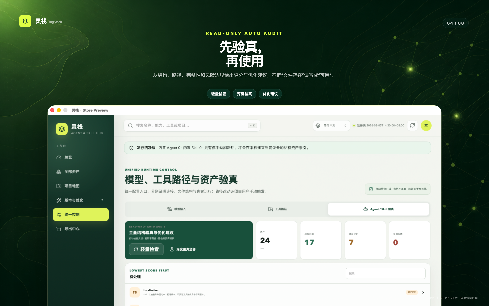
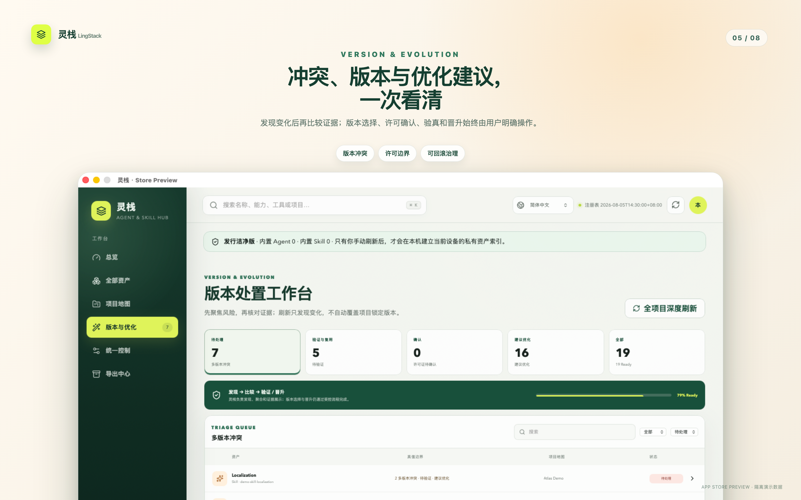
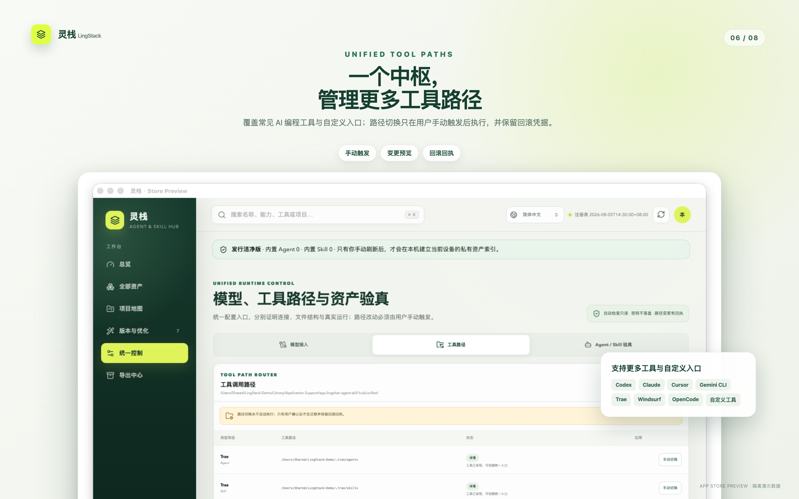
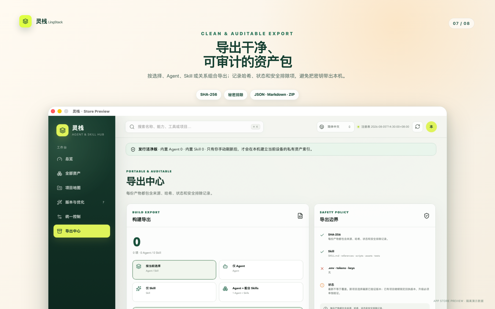

# LingStack · 灵栈

<p align="center">
  <strong>One local control plane for every Agent and Skill.</strong><br>
  一个面向多种 AI 工具的本地 Agent 与 Skill 统一管理中枢。
</p>

<p align="center">
  <a href="https://github.com/dw-zhu-si/LingStack-Agent_Skill-Hub/releases">Download</a> ·
  <a href="https://pm.jcm99.com/apple/lingstack/">Product page</a> ·
  <a href="https://pm.jcm99.com/apple/lingstack/privacy.html">Privacy</a> ·
  <a href="SUPPORT.md">Support</a>
</p>


LingStack is a local-first macOS application for discovering, cataloging, comparing, verifying, improving, and exporting Agent and Skill definitions. It turns scattered folders from different AI tools into an evidence-based capability inventory without pretending that “a file exists” means “it works.”

灵栈解决的不是“再建一个文件夹”，而是 Agent / Skill 资产逐渐分散之后的治理问题：它们在哪里、属于哪个项目、是否重复、版本是否冲突、许可证是否确认、运行效果是否验证，以及下一步究竟应该选择、验真、优化还是导出。

> The public repository and every public installer start with an empty asset library. They contain no personal Agent, Skill, private registry, model credential, or machine-specific configuration.

## Why LingStack / 为什么需要灵栈

As AI development tools multiply, the same capability is often copied into Codex, Claude, Trae, Cursor, Copilot, Gemini CLI, OpenCode, Cline, Roo Code, Windsurf, Continue, Kiro, and project-local directories. Names drift, content diverges, old versions remain active, and teams lose the evidence needed to decide what is reusable.

LingStack creates one auditable workflow:

1. **Discover** — read supported locations only after a user-triggered refresh.
2. **Normalize** — group physical files into logical Agent and Skill assets.
3. **Compare** — show hashes, locations, projects, versions, and conflicts.
4. **Verify** — distinguish static inspection, local visibility, and actual validation.
5. **Govern** — record version choice, license confirmation, verification evidence, and optimization drafts.
6. **Export** — create JSON, Markdown, or sanitized ZIP packages with explicit warnings and checksums.

## Product capabilities / 产品能力

| Area | What LingStack provides |
|---|---|
| Unified inventory | One searchable view across Agent, Skill, tool, project, source, license, lifecycle state, and content hash. |
| Project capability map | A project-centric map that exposes capability mix, reuse coverage, pending assets, and relationship evidence. |
| Version governance | Conflict queues, explicit variant selection, pinned versions, promotion gates, and traceable receipts. |
| 版本辅助决策 | 两个内容版本的逐行差异、目标来源和验证偏好、建议依据与候选预填；证据不足不指定版本，不以长度或时间判断优劣。 |
| Verification | Lightweight or deep static audits for readability, metadata, structure, references, risk signals, and optimization opportunities. |
| Optimization workflow | Creates an editable draft and plan, preserves the original, records hashes, and requires explicit application. |
| Model access | Connects to Ollama and OpenAI-compatible endpoints, automatically fetches all visible models, supports multi-model selection, and stores secrets in macOS Keychain. |
| Tool path control | The GitHub edition previews migrations and changes paths only after exact user confirmation, with backup and rollback receipts. |
| Safe export | JSON, Markdown, and sanitized ZIP export with credential, cache, dependency, symlink, size, and secret-shape filtering. |
| Localization | 11 interface languages with RTL support for Arabic and an automated catalog completeness gate. |

## Evidence, not optimistic labels / 状态必须有证据

LingStack deliberately separates states that many managers collapse into a single “available” badge:

- **Recorded** — metadata exists in the local index.
- **Visible locally** — a source path was observed during a user-triggered scan.
- **Version selected** — the user chose one content variant.
- **License confirmed** — a decision and evidence were recorded.
- **Verified locally** — a static or runtime verification receipt exists for the selected hash.
- **Ready to reuse** — selection, license, verification, and freshness requirements are all satisfied.

This prevents stale files, historical paths, or unverified copies from being silently promoted as trustworthy assets.

## Two macOS editions / 两种 macOS 发行版

| Capability | GitHub edition | Mac App Store edition |
|---|---:|---:|
| Empty, privacy-audited distribution | ✓ | ✓ |
| Local inventory and project map | ✓ | ✓ |
| Verification, governance, optimization, export | ✓ | ✓ |
| Model endpoints chosen by the user | ✓ | ✓ |
| Automatic discovery of known tool folders | ✓ | — |
| User-selected folders | ✓ | ✓ |
| Persistent folder access | Native filesystem | Security-scoped bookmarks |
| Tool path migration and rollback | Manual only | Disabled by sandbox design |
| Distribution security | Developer ID + notarization | App Sandbox + Apple distribution signing |

The App Store edition never searches arbitrary home-directory locations. It reads only folders selected in the macOS system picker and never rewrites another tool's configuration path. The GitHub edition provides broader local integration, but path changes still never run automatically.

## Supported tools / 支持的工具生态

The GitHub edition includes discovery and path profiles for:

- Codex
- Claude
- Trae and Trae CN
- TRAE Work
- Cursor
- GitHub Copilot
- Gemini CLI
- OpenCode
- Cline
- Roo Code
- Windsurf
- Continue
- Kiro

This list is not a closed ecosystem. Any tool with an Agent or Skill directory can be registered through a custom binding. In the App Store edition, custom registration is the only discovery route and always begins with explicit folder selection.

## Model integration / 模型接入

LingStack can manage multiple model profiles and multiple models per profile.

- Supports Ollama and OpenAI-compatible APIs.
- Normalizes base URLs and common `/v1`, `/models`, and chat endpoint forms.
- Fetches the complete visible model list instead of forcing one manually typed model name.
- Lets the user select a default inference model while retaining the full managed model catalog.
- Offers connectivity and minimal inference probes with bounded timeouts and response sizes.
- Stores API credentials in macOS Keychain; configuration files contain references, not plaintext secrets.
- Sends requests only to endpoints configured by the user. No LingStack relay service is involved.

## Privacy and safety by design / 隐私与安全边界

- No Agent or Skill is bundled in source archives or installers.
- No background full-disk scan; discovery is explicit and allowlisted.
- No analytics, advertising SDK, telemetry collector, or cloud account requirement.
- No automatic execution of discovered Agent or Skill content.
- No automatic optimization overwrite; drafts, source hashes, backups, and receipts are retained.
- No automatic tool-path change; the GitHub edition requires a preview and exact confirmation.
- No plaintext model credential storage; macOS Keychain is used.
- Export rejects private-key material, secret-shaped values, environment files, cookies, databases, caches, dependency folders, symlinks, and oversized files.
- Release artifacts pass a fail-closed privacy audit for personal paths, secret patterns, private registry markers, and bundled Agent/Skill definitions.

Read the full [privacy boundary](docs/PRIVACY.md), [architecture](docs/ARCHITECTURE.md), and [security policy](SECURITY.md).

## Screenshots / 产品预览

<table>
  <tr>
    <td></td>
    <td></td>
  </tr>
  <tr>
    <td></td>
    <td></td>
  </tr>
  <tr>
    <td></td>
    <td></td>
  </tr>
</table>

The eight App Store-ready promotional images are 2880 × 1800 and use isolated synthetic data. No screenshot contains the maintainer's personal Agent, Skill, path, model key, or registry.

## Languages / 多国语言

LingStack currently supports:

简体中文 · 繁體中文 · English · 日本語 · 한국어 · Français · Deutsch · Español · Português · Русский · العربية

The locale runtime updates the document language and direction, so Arabic uses RTL layout. `npm run check:i18n` verifies catalog shape, placeholder consistency, required keys, and locale completeness.

## Download and install / 下载与安装

### GitHub release

Download the notarized universal macOS DMG or ZIP from [GitHub Releases](https://github.com/dw-zhu-si/LingStack-Agent_Skill-Hub/releases). The universal build supports both Apple silicon and Intel Macs.

- **DMG** — drag LingStack to Applications.
- **ZIP** — extract and move the app to Applications.
- **SHA-256 checksums** — published with each release for independent verification.

### Mac App Store

The sandboxed edition is distributed separately through the Mac App Store. It uses the same empty-library policy and core governance features, with user-selected folder access replacing automatic tool-directory discovery and path switching.

## Development / 开发

Requirements: Node.js 22+, Rust stable, and Xcode Command Line Tools on macOS.

```bash
npm ci
npm run check:i18n
npm run check
npm run build
npm run test:rust
npm run tauri dev
```

Run the complete local quality gate:

```bash
npm run ci
```

Build the clean Developer ID edition:

```bash
npm run release:clean
```

Build the sandboxed Mac App Store package (requires the developer's provisioning profile and Apple signing identities):

```bash
npm run release:app-store
```

Signing credentials, provisioning profiles, API keys, and generated release artifacts are ignored by Git and are never part of the source repository.

## Repository map / 代码结构

```text
src/                              Svelte UI, design system, and application state
src/lib/i18n.ts                   11-language catalog and locale runtime
src/lib/components/               Inventory, map, verification, model, and path panels
src-tauri/src/registry.rs         Explicit local discovery and normalized index
src-tauri/src/control.rs          Model profiles and tool-directory governance
src-tauri/src/sandbox.rs          App Store security-scoped bookmark access
src-tauri/src/verification.rs     Static verification and optimization suggestions
src-tauri/src/governance.rs       Selection, license, verification, and draft receipts
src-tauri/src/export.rs           Sanitized export pipeline
scripts/audit-clean-release.py    Fail-closed installer privacy audit
scripts/build-clean-release.sh    Developer ID release pipeline
scripts/build-app-store-release.sh App Store signing and package pipeline
app-store/metadata/               Localized App Store copy for 11 locales
marketing/store-preview/          Synthetic fixtures and promotional screenshots
site/apple/lingstack/             Product, privacy, and support pages
```

## Contributing / 参与贡献

Issues and focused pull requests are welcome. Before submitting code, run `npm run ci`, avoid adding real Agent/Skill assets or machine-specific paths, and document any change that affects discovery, file writes, model traffic, permissions, or truth-level semantics.

See [CONTRIBUTING.md](CONTRIBUTING.md) for the workflow. Report vulnerabilities privately according to [SECURITY.md](SECURITY.md); never place credentials or private asset definitions in a public issue.

## Release integrity / 发行完整性

Every clean release is expected to satisfy four independent gates:

1. Source checks and tests pass.
2. The app bundle contains only the executable, icon, metadata, signature, and—only for the App Store edition—the provisioning profile.
3. Code signing and package signatures validate against the intended distribution identity.
4. Public artifacts contain no personal path, private registry marker, secret-shaped value, or Agent/Skill definition.

Notarization, App Store processing, and GitHub publication are reported separately; a successful local build is never presented as proof that an external store accepted it.

## License

Licensed under the [Apache License 2.0](LICENSE). Copyright © 2026 野路子工作室.

## 更新开发中的工作台增强

2026-09-16 开发分支新增工具、项目及来源筛选，普通搜索覆盖来源路径；桌面端支持显式全文搜索、命中版本定位与定义原文阅读。预览显示行数、字节数及静态 Token 估算，估算不代表真实调用或账单。全文搜索有读取与结果预算，并显示跳过和截断状态。

本轮增加共享 `.agents/skills` 与 Antigravity 全局技能目录的只读发现，修复多行描述读取。扫描和预览均不执行技能正文，也不自动改写技能文件。浏览器预览不能读取本机定义。

HTTP 集成测试需要先为本项目预留两个测试端口，再设置 `LINGSTACK_TEST_LIST_PORT` 和 `LINGSTACK_TEST_INFERENCE_PORT`，使用 `cargo test --manifest-path src-tauri/Cargo.toml -- --include-ignored` 执行完整回归；商店版增加 `--features app-store`。普通测试不会自行选择监听端口。

这些是本地开发变更，现有 v0.11.0 下载与商店制品不包含本轮改动。

2026-09-27 本地开发构建增加“对比选版 → 帮我选择”：先读取两个真实版本，按目标来源及保留当前/优先验证偏好提供可解释建议；缺少证据时不指定版本。建议只预填候选，最终确认才保存。同步修复资产身份碰撞、失效验证状态、导出哈希一致性、项目精确筛选、审计分页与模型编辑响应串写，并修补 devalue 依赖告警。检查范围、验证结果与后续路线见 [0.12.0 更新说明](docs/releases/0.12.0.md)。
